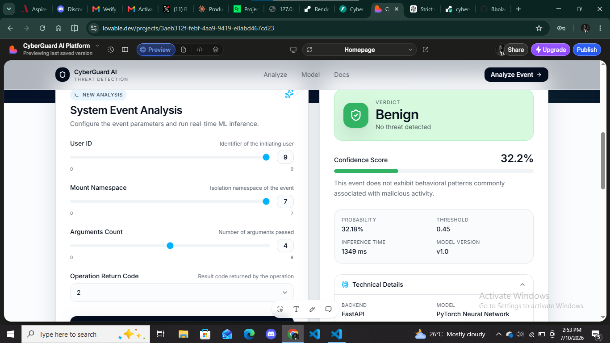
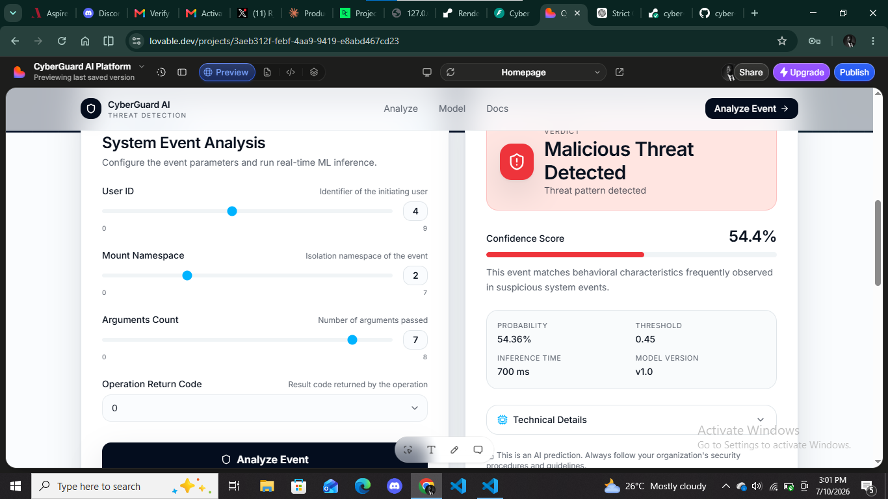
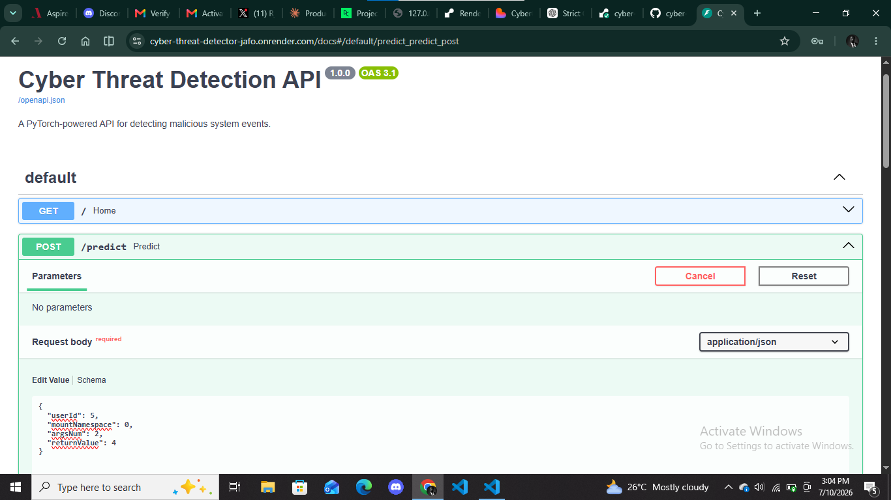

# 🛡️ CyberGuard AI
### End-to-End Machine Learning Cyber Threat Detection System

[](https://python.org)
[](https://fastapi.tiangolo.com/)
[](https://pytorch.org/)
[](https://render.com/)
[](LICENSE)

---

## 🚀 Live Demo

🌐 **Frontend**

https://cyberguard-ai-12.lovable.app

📚 **API Documentation**

https://cyber-threat-detector-jafo.onrender.com/docs

⚡ **Backend API**

https://cyber-threat-detector-jafo.onrender.com

---

# Overview

CyberGuard AI is a production-ready Machine Learning system for detecting malicious operating system events in real time.

The project combines:

- PyTorch Neural Network
- FastAPI REST API
- Render Cloud Deployment
- Interactive Swagger Documentation
- Modern Lovable Frontend
- Real-time inference

Instead of remaining a notebook-based ML project, the model has been deployed as a complete web application capable of serving predictions through an API and an interactive frontend.

---

# Features

✅ End-to-end ML deployment

✅ PyTorch Neural Network inference

✅ FastAPI backend

✅ Interactive Swagger API

✅ Real-time prediction dashboard

✅ Probability & confidence visualization

✅ Threat classification

- Benign
- Malicious

✅ Cloud deployment (Render)

✅ Responsive frontend

---

# IMAGES

## Benign Prediction



---

## Malicious Prediction



---

## Swagger Documentation



---

# System Architecture

```
              User
                │
                ▼
      Lovable Frontend
                │
         HTTP Request
                │
                ▼
         FastAPI Backend
                │
        Feature Scaling
                │
                ▼
      PyTorch Neural Network
                │
      Threat Probability
                │
                ▼
      JSON API Response
                │
                ▼
      Interactive Dashboard
```

---

# Machine Learning Pipeline

```
Raw System Event

        │

        ▼

Feature Extraction

        │

        ▼

StandardScaler

        │

        ▼

PyTorch Neural Network

        │

        ▼

Sigmoid Probability

        │

        ▼

Threat Classification
```

---

# Tech Stack

### Machine Learning

- PyTorch
- NumPy
- Scikit-Learn

### Backend

- FastAPI
- Uvicorn
- Pydantic

### Frontend

- Lovable

### Deployment

- Render

### Model Persistence

- Joblib
- PyTorch State Dict

---

# Input Features

The deployed model currently predicts using four structured event features.

| Feature | Description |
|----------|-------------|
| userId | User initiating the event |
| mountNamespace | Namespace identifier |
| argsNum | Number of arguments |
| returnValue | Operation return code |

---

# Prediction Response

Example response

```json
{
    "prediction": "Malicious",
    "probability": 0.5436
}
```

---

# API Usage

## POST

```
/predict
```

Example Request

```json
{
    "userId": 5,
    "mountNamespace": 0,
    "argsNum": 4,
    "returnValue": 2
}
```

Example Response

```json
{
    "prediction": "Benign",
    "probability": 0.3218
}
```

---

# Project Structure

```
cyber-threat-detector/

│

├── app/
│   └── main.py
│
├── data/
│   ├── labelled_train.csv
│   ├── labelled_validation.csv
│   ├── labelled_test.csv
│
├── models/
│   ├── best_model.pth
│   └── scaler.pkl
│
├── requirements.txt
├── runtime.txt
└── README.md
```

---

# Installation

Clone the repository

```bash
git clone https://github.com/Rbolarinwa-DS/cyber-threat-detector.git

cd cyber-threat-detector
```

Install dependencies

```bash
pip install -r requirements.txt
```

Run locally

```bash
uvicorn app.main:app --reload
```

API available at

```
http://127.0.0.1:8000/docs
```

---

# Deployment

Backend

- FastAPI
- Render Cloud

Frontend

- Lovable

---

# Future Improvements

- Add explainable AI (SHAP)
- Support batch inference
- Docker containerization
- CI/CD with GitHub Actions
- Authentication
- Monitoring & logging
- GPU inference support
- Model versioning
- Database logging
- Threat history dashboard

---

# Skills Demonstrated

- Machine Learning
- Deep Learning
- PyTorch
- FastAPI
- REST API Development
- Model Deployment
- Cloud Deployment
- Backend Engineering
- Feature Engineering
- Model Serialization
- Production Inference
- Git
- GitHub
- API Documentation

---

# Author

**Rbolarinwa**

Computer Science Student | Machine Learning Engineer

GitHub

https://github.com/Rbolarinwa-DS

Project Repository

https://github.com/Rbolarinwa-DS/cyber-threat-detector

---

## If you found this project interesting, consider giving it a ⭐
