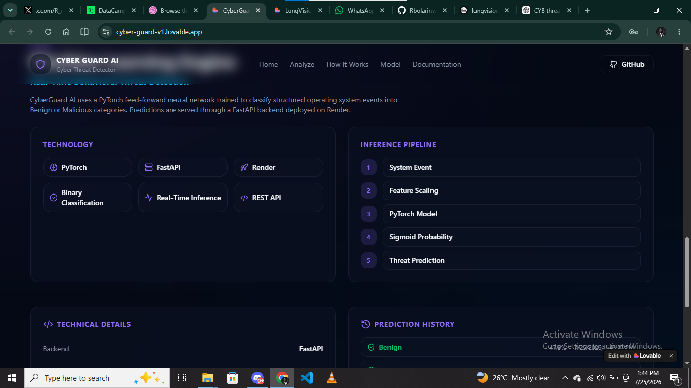
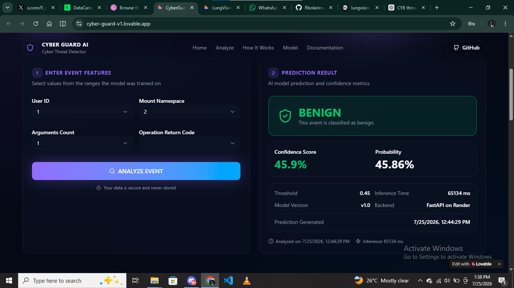

<p align="center">


# 🛡️ CyberGuard AI

### AI-Powered Behavioral Cyber Threat Detection

Detect malicious system events using a **PyTorch Neural Network** and receive real-time threat predictions through a modern web interface.

Built with **PyTorch**, **FastAPI**, **Render**, and **Lovable**.

[🌐 Live Demo](https://cyber-guard-v1.lovable.app/) • [📖 API Docs](https://cyber-threat-detector-jafo.onrender.com/docs)

</p>

---


---

# 📸 Application Preview

## 🏠 Landing Page

<p align="center">


</p>

---

## 🤖 Threat Analysis Dashboard

<p align="center">



</p>

---

## 📊 Prediction Report

<p align="center">



</p>

---

# 📖 Overview

CyberGuard AI is an end-to-end Machine Learning application that analyzes structured operating system event features to classify activity as **Benign** or **Malicious**.

The project demonstrates the complete Machine Learning Engineering lifecycle—from data preprocessing and neural network training to deployment through FastAPI, Render, and a modern Lovable frontend.

---

# 🚀 Features

- 🧠 PyTorch Neural Network
- ⚡ Real-Time Threat Detection
- 📊 Confidence Score & Probability
- 🎯 Decision Threshold Display
- 🚀 FastAPI REST API
- ☁️ Render Cloud Deployment
- 💜 Modern Responsive UI
- 📱 Mobile Friendly
- 📖 Interactive API Documentation

---

# 💡 Why CyberGuard AI?

Modern cyber threats evolve rapidly, making behavioral analysis an important complement to traditional signature-based detection.

CyberGuard AI demonstrates how Machine Learning can assist security analysts by:

- Performing real-time behavioral threat assessment
- Providing confidence-based predictions
- Exposing predictions through a production-ready REST API
- Demonstrating end-to-end Machine Learning deployment

CyberGuard AI is designed as an educational and research project showcasing practical ML Engineering principles.

---

# 📚 Dataset Summary

**Dataset**

BETH Cybersecurity Dataset

The model was trained on structured operating system event data representing both benign and malicious behaviors.

Selected features include:

- User ID
- Mount Namespace
- Arguments Count
- Operation Return Code

Features were standardized using **StandardScaler** before training to ensure consistent inference performance.

---

# 📈 Model Performance

| Metric | Score |
|---------|-------|
| Accuracy | **68.00%** |
| Precision | **27.78%** |
| Recall | **31.25%** |
| F1 Score | **29.41%** |
| Architecture | Feed-Forward Neural Network |
| Framework | PyTorch |

The model demonstrates an end-to-end deployment workflow for behavioral cyber threat detection.

---

# 🛡️ Prediction Classes

- Benign
- Malicious

---

<<<<<<< HEAD
# IMAGES

## Benign Prediction


---

## Malicious Prediction


---

## Swagger Documentation


---

# System Architecture

```
              User
                │
                ▼
      Lovable Frontend
                │
         HTTP Request
                │
                ▼
         FastAPI Backend
                │
        Feature Scaling
                │
                ▼
      PyTorch Neural Network
                │
      Threat Probability
                │
                ▼
      JSON API Response
                │
                ▼
      Interactive Dashboard
```

---

# Machine Learning Pipeline

```
Raw System Event

        │

        ▼

Feature Extraction

        │

        ▼

StandardScaler

        │

        ▼

PyTorch Neural Network

        │

        ▼

Sigmoid Probability

        │

        ▼

Threat Classification
```

---

# Tech Stack
=======
# 🏗️ Technology Stack
>>>>>>> 32bc3cc (Update README images)

### Machine Learning

- PyTorch
- Scikit-learn
- NumPy
- Pandas
- Joblib

### Backend

- FastAPI
- Uvicorn
- Pydantic

### Frontend

- Lovable
- React
- TypeScript
- Tailwind CSS

### Deployment

- Render

---

# 📂 Project Structure

<<<<<<< HEAD
The deployed model currently predicts using four structured event features.

| Feature | Description |
|----------|-------------|
| userId | User initiating the event |
| mountNamespace | Namespace identifier |
| argsNum | Number of arguments |
| returnValue | Operation return code |

---

# Prediction Response

Example response

```json
{
    "prediction": "Malicious",
    "probability": 0.5436
}
```

---

# API Usage

## POST

```
/predict
```

Example Request

```json
{
    "userId": 5,
    "mountNamespace": 0,
    "argsNum": 4,
    "returnValue": 2
}
```

Example Response

```json
{
    "prediction": "Benign",
    "probability": 0.3218
}
```

---

# Project Structure

```text
cyber-threat-detector/
│
├── app/
│   └── main.py                 # FastAPI application & inference endpoint
│
├── data/
│   ├── labelled_train.csv
│   ├── labelled_validation.csv
│   ├── labelled_test.csv
│   └── labelled_training_data.csv
│
├── images/                    #includes homepage 
│   ├── benign.png
│   ├── malicious.png
│   └── swagger.png
=======
```text
CyberGuard-AI/

├── app/
│   ├── main.py
│   └── model.py
>>>>>>> 32bc3cc (Update README images)
│
├── models/
│   ├── best_model.pth          # Trained PyTorch model
│   └── scaler.pkl              # Serialized StandardScaler
│
<<<<<<< HEAD
├── notebook.ipynb              # Model development & experimentation
├── requirements.txt            # Python dependencies
├── runtime.txt                 # Python version for Render
├── .gitignore
├── README.md
└── LICENSE                     
```

# Installation
=======
├── images/
│
├── requirements.txt
├── runtime.txt
├── README.md
└── LICENSE
```

---

# 📡 API

### Health Check

```http
GET /
```

### Prediction

```http
POST /predict
```

Input

```json
{
  "userId": 1,
  "mountNamespace": 2,
  "argsNum": 3,
  "returnValue": 0
}
```

Returns

```json
{
  "prediction": "Malicious",
  "probability": 0.5137
}
```

---

# ⚙️ Run Locally
>>>>>>> 32bc3cc (Update README images)

Clone the repository

```bash
git clone https://github.com/Rbolarinwa-DS/cyber-threat-detector.git
```

Install dependencies

```bash
pip install -r requirements.txt
```

Run the API

```bash
python -m uvicorn app.main:app --reload
```

Open

```
http://127.0.0.1:8000/docs
```

---

# ⚠️ Current Limitations

Although CyberGuard AI demonstrates a production-ready deployment workflow, there are still limitations.

- Uses four structured input features
- Educational proof-of-concept
- Limited feature engineering
- No user authentication
- No prediction history
- Not intended for production security environments

---

# 🛣️ Roadmap

## ✅ Version 1.0

- End-to-End Deployment
- PyTorch Neural Network
- FastAPI Backend
- Render Deployment
- Responsive Frontend
- Live REST API

### 🚀 Version 2.0

- Docker Support
- CI/CD Pipeline
- User Authentication
- Prediction History
- Model Monitoring Dashboard
- Explainable AI
- Enhanced Feature Engineering

---

# 📜 Disclaimer

CyberGuard AI is intended for **educational, research, and demonstration purposes only.**

Predictions generated by the model should complement—not replace—professional cybersecurity monitoring and incident response practices.

---

# ⭐ Support

If you found this project useful, consider giving it a **Star ⭐**.

It helps support the project and motivates future development.

---

# 👨‍💻 Author

**Rahman-Bolarinwa**

Machine Learning Engineer • Data Scientist

Building practical AI solutions from research to deployment.